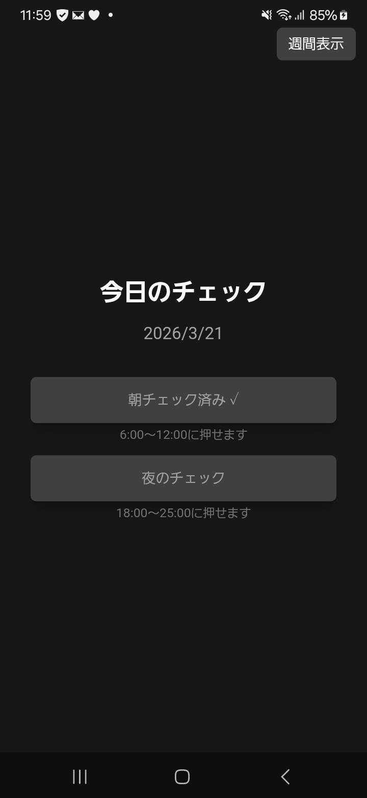
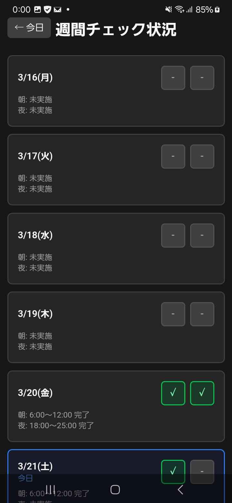

# my-check-app

A lightweight desktop application built with Tauri, SvelteKit, and TypeScript for checking and managing tasks.

## Tech Stack

- **Frontend**: SvelteKit + TypeScript + Tailwind CSS
- **Desktop Framework**: Tauri 2
- **Package Manager**: bun

## Getting Started

### Prerequisites

- [Rust](https://www.rust-lang.org/)
- [Node.js](https://nodejs.org/) or [bun](https://bun.sh/)

### Installation

```bash
# Install dependencies
bun install

# Start development server
bun run dev
```

### Supabase Setup

See [docs/supabase-setup.md](docs/supabase-setup.md) for detailed setup instructions including:
- Supabase project creation
- Database table creation (daily_checks, time_settings)
- Environment variables configuration
- Backend implementation of time settings API

## Development

### Desktop Development

```bash
# Run the dev server with Tauri
bun run tauri dev
```

### Android Development

```bash
# Initialize Android development environment (first time only)
bun run tauri android init

# Run the app on Android device or emulator
bun run tauri android dev

# Build APK for Android
bun run tauri android build
```

**Prerequisites for Android:**
- [Android SDK](https://developer.android.com/studio)
- [Android NDK](https://developer.android.com/ndk)
- Android emulator or connected device

### Building

```bash
# Build for production
bun run build

# Preview the built app
bun preview
```

### Type Checking

```bash
# Check types and Svelte components
bun run check

# Watch mode for continuous checking
bun run check:watch
```

## Recommended IDE Setup

- [VS Code](https://code.visualstudio.com/)
- [Svelte](https://marketplace.visualstudio.com/items?itemName=svelte.svelte-vscode)
- [Tauri](https://marketplace.visualstudio.com/items?itemName=tauri-apps.tauri-vscode)
- [rust-analyzer](https://marketplace.visualstudio.com/items?itemName=rust-lang.rust-analyzer)

## License

MIT

## Screen Shots



